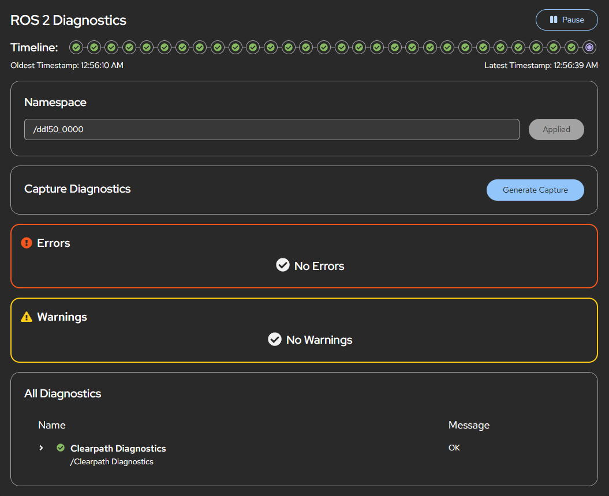

# Cockpit ROS 2 Diagnostics

> **Fork note (CLAIRLab, HAW Hamburg).** This is a fork of
> [clearpathrobotics/cockpit-ros2-diagnostics](https://github.com/clearpathrobotics/cockpit-ros2-diagnostics)
> that adds a [Manipulator panel](#manipulator-panel) for the arm and the end
> effector, an [out-of-service level and severity overrides](#severity-out-of-service-and-overrides),
> and a [German translation](#translations). Everything else is unchanged and
> upstream stays the merge base.

This is a Cockpit application that is intended to be installed alongside [Cockpit](https://cockpit-project.org/) and connects to the [foxglove bridge](https://docs.foxglove.dev/docs/connecting-to-data/ros-foxglove-bridge)

This application is built on the Cockpit starter kit (https://github.com/cockpit-project/starter-kit) and using modified code files from https://github.com/tier4/roslibjs-foxglove.



# Installation instructions

This is installed and running automatically on Clearpath Robots without any manual installation required. For all other ROS computers, proceed with the following instructions.

The following instructions should be completed on the computer that is to be monitored and managed using the Cockpit interface. In most cases this will be the robot computer.

1. Install cockpit: https://cockpit-project.org/running.html#ubuntu

2. Add the Clearpath Robotics Package Server:

    ```bash
    wget https://packages.clearpathrobotics.com/public.key -O - | sudo apt-key add -
    sudo sh -c 'echo "deb https://packages.clearpathrobotics.com/stable/ubuntu $(lsb_release -cs) main" > /etc/apt/sources.list.d/clearpath-latest.list'
    sudo apt update
    ```

3. Install this module and the Foxglove bridge

    ```bash
    sudo apt install cockpit-ros2-diagnostics ros-$ROS_DISTRO-foxglove-bridge
    ```

4. In order to open the UI on a remote computer and connect to the Foxglove bridge, an unsecured connection (http) must be used. Allow an unencrypted HTTP connection by creating the [cockpit.conf](https://cockpit-project.org/guide/latest/cockpit.conf.5) file and set `AllowUnencrypted=true` in the `WebService` section. This is all done by running the following command:

    ```bash
    echo "[WebService]
    AllowUnencrypted=true" | sudo tee /etc/cockpit/cockpit.conf
    ```

# Usage Instructions

1. If not using a Clearpath Robot then you will need to start your [Foxglove bridge](https://docs.foxglove.dev/docs/connecting-to-data/ros-foxglove-bridge) manually. It must be launched with the default port (8765):

    ```bash
    ros2 launch foxglove_bridge foxglove_bridge_launch.xml
    ```

2. Open a [supported browser](https://cockpit-project.org/running) and go to `http://<ip-address>:9090` but replace `<ip-address>` with the ip address or hostname of your robot computer. Remember to use the IP address for the network over which you are connecting to the robot. In order for the websocket connection to work and successfully receive the ROS 2 topics, cockpit must be accessed over http, which is an unsecure connection. **Setting up a secure connection over https is currently unsupported**, but contributions are welcome.

3. Go to the ROS 2 Diagnostics tab.

# Manipulator panel

On top of the generic diagnostics tree, this fork renders a dedicated
**Manipulator** card: an *Arm* tile (robot mode, safety mode, external control,
motion link, joint table, controller chips) and an *End effector* tile (opening
bar, grip detected, motion, tool power, force preset, last command).

It is a pure read over the aggregated diagnostics the app already subscribes to
— **no additional topic subscription**, so pause, history and reconnect apply to
it unchanged. On a robot without manipulator diagnostics the panel renders
nothing at all.

## Where the data comes from

The panel looks for these statuses in `<namespace>/diagnostics_agg`:

| Status name | Contents |
|---|---|
| `manipulator_diagnostics: Arm Mode` | `robot_mode`, `safety_mode` |
| `manipulator_diagnostics: Arm Control` | external control, joint\_state rate/age, motion link |
| `manipulator_diagnostics: Arm Joints` | `joints` (ordered CSV) plus `<joint>_rad` / `<joint>_deg` / `<joint>_vel_rad_s` / `<joint>_effort` |
| `manipulator_diagnostics: Arm Controllers` | one key per controller, value = its state |
| `manipulator_diagnostics: Gripper` | `width_mm`, `width_percent`, `stroke_mm`, `grip_detected`, `busy`, `signal_valid`, `tool_power_commanded`, `high_force_preset`, `last_command`, `force_raw_v` |

`tool_power_commanded` is named for what it is: the driver's commanded setpoint,
not hardware feedback — it stays true after the tool loses power. The panel
therefore pairs it with `signal_valid` and only shows it green when the analog
signal confirms the tool actually answers.

These key names are a contract with no compile-time enforcement, so
`test/unit/contract.test.ts` checks them in both directions against a capture of
what the robot publishes: every key the panel reads must exist, and every
contracted key must still be read. Run it with `make check-unit` (node only, no
VM or browser). Refresh `test/unit/agg-armed.json` from a live
`/<ns>/diagnostics_agg` when the publisher changes.

Statuses are matched by their raw name, not by the analyzer path, so the panel
does not care how the aggregator groups them.

Values that the publisher cannot vouch for are expected to be absent or
non-numeric rather than invented: the opening bar is not drawn when
`width_percent` does not parse, and a boolean that is neither `"true"` nor
`"false"` renders as *unknown* instead of defaulting to false. This is what
keeps a powered-down gripper from displaying a confident "0 mm, moving".

Nothing in ROS publishes these out of the box: the UR driver reports its state
as `ur_dashboard_msgs`, a gripper driver in its own message type, and the arm's
`controller_manager` publishes into the manipulator namespace rather than onto
the topic the aggregator consumes. A small bridge node has to translate them
into `diagnostic_msgs` and publish onto the aggregator's `/diagnostics` topic.

For the a200-0553 (UR5 CB3 + OnRobot RG6) that node is
[`manipulator_diagnostics.py`](https://github.com/CLAIRLab-HAW/husky-custom-setup/blob/main/scripts/manipulator_diagnostics.py)
in `husky-custom-setup`, which also installs it as a boot service and registers
the matching aggregator analyzers. To feed the panel from a different arm or
gripper, publish the same status names and value keys — the panel needs nothing
else.

# Severity: out of service, and overrides

`diagnostic_msgs/DiagnosticStatus` only knows OK / WARN / ERROR / STALE. Two
things are missing for an operator view, and this fork adds both in
`src/utils/severity.ts`.

## The INACTIVE level

A subsystem that is deliberately switched off is neither OK (it is not working)
nor a fault (nobody needs to do anything). Painting a powered-down arm yellow or
red trains people to ignore colours. INACTIVE renders grey, labelled *Out of
service*, and dims the readings of the affected card — they are last-known
values, not live state.

It is a **display** level with the value `-2`, deliberately below OK: group
levels roll up with `Math.max()`, so a group only reads inactive when all of its
children do, and a single real fault still wins.

A publisher opts in by adding the value `display=inactive` to a status while
leaving the level at OK. That keeps the message standards-compliant — every
other consumer (`rqt_robot_monitor`, the diagnostics capture) sees a plain OK
with an explanatory message — and only this UI paints it grey.

## Overrides

Some upstream nodes classify harmless, permanent conditions as ERROR, which
drags the whole robot's rollup to red and buries real faults. `SEVERITY_OVERRIDES`
reclassifies those. Shipped rules:

| Status | Reported | Displayed | Why |
|---|---|---|---|
| `joy_node: Joystick Driver Status` — "Joystick not open." | ERROR | INACTIVE | No gamepad plugged in is the standing configuration on a software-driven robot. |
| `controller_manager: Hardware Components Activity` — "High execution jitter or mean error" | ERROR | WARNING | Inherent to the A200's 10 Hz serial base link; worth seeing, not a drive fault. |

Each rule matches on the status name **and** a message substring, so the same
status still turns red for a *different* problem. Nothing is hidden: the detail
drawer shows the reported level next to the displayed one, with the reason.

Overridden leaves are rolled up into their analyzer groups (the aggregator
publishes group statuses computed from the *reported* child levels, so without
this a downgraded leaf would leave its group red). Recomputation is limited to
groups that actually contain an override — every untouched group keeps exactly
the level the aggregator published.

For the jitter case the upstream-correct fix would be to raise
`diagnostics.threshold.hardware_components.*` on the `controller_manager`; that
silences the message entirely rather than downgrading it, which is why it is
done here instead.

# Translations

Translations live in `po/` and are compiled into `dist/po.<lang>.js` by the
build; Cockpit loads the file matching the user's language, including a separate
bundle for the menu entry in `manifest.json`. This fork ships **German**
(`po/de.po`), since a German Cockpit with an English-only plugin tab reads
badly.

Convention: technical identifiers stay untranslated — ROS names (namespace,
topic and joint names), UR product terms such as *ExternalControl*, and unit
symbols. Only the interface chrome around them is translated.

Note that diagnostic *messages* are data, not interface text: they arrive as
plain strings from the publishing node and are shown verbatim. On the a200-0553
the manipulator statuses are German because `manipulator_diagnostics` emits them
that way; upstream Clearpath statuses remain English.

To add a language, copy `po/de.po`, translate, and rebuild.

## Installing this fork on a robot

Cockpit searches `~/.local/share/cockpit`, `/etc/cockpit`,
`/usr/local/share/cockpit`, `/usr/share/cockpit` in that order, so installing to
`/usr/local` **overrides** the Debian package in `/usr/share` without replacing
it. The package directory name must stay `ros2-diagnostics` (the `name` in
`package.json`) for that to work — a different name shows up as a second menu
entry instead.

```bash
make
sudo make install            # -> /usr/local/share/cockpit/ros2-diagnostics
```

To go back to the packaged version, remove that directory; no apt operation is
needed. While the override is in place, apt updates of
`cockpit-ros2-diagnostics` have no visible effect — rebase the fork when you
want them.

On the a200-0553 the `husky-custom-setup` installer does this as an optional
step. It deliberately does **not** install a node toolchain on the robot: it
prefers a prebuilt `dist/` in the checkout and only builds on the robot if
`npm` and `make` happen to be present. The recommended flow is to build on a
workstation and copy the result over:

```bash
make && rsync -a dist/ robot@<robot>:~/cockpit-ros2-diagnostics/dist/
```

(`dist/` is gitignored upstream. If you would rather have fully offline robot
installs, drop that line from `.gitignore` and commit the build output.)

# Development and Source Instructions

## Development dependencies

On Ubuntu:

    sudo apt install gettext nodejs npm make

## Getting and building the source

These commands check out the source and build it into the `dist/` directory:

```bash
git clone https://github.com/clearpathrobotics/cockpit-ros2-diagnostics.git
cd cockpit-ros2-diagnostics
make
```

## Installing

`make install` compiles and installs the package in `/usr/local/share/cockpit/`. The
convenience targets `srpm` and `rpm` build the source and binary rpms,
respectively. Both of these make use of the `dist` target, which is used
to generate the distribution tarball. In `production` mode, source files are
automatically minified and compressed. Set `NODE_ENV=production` if you want to
duplicate this behavior.

For development, you usually want to run your module straight out of the git
tree. To do that, run `make devel-install`, which links your checkout to the
location were cockpit-bridge looks for packages. If you prefer to do
this manually:

```bash
mkdir -p ~/.local/share/cockpit
ln -s `pwd`/dist ~/.local/share/cockpit/cockpit-ros2-diagnostics
```

After changing the code and running `make` again, reload the Cockpit page in
your browser.

You can also use
[watch mode](https://esbuild.github.io/api/#watch) to
automatically update the bundle on every code change with

    ./build.js -w

or

    make watch

When developing against a virtual machine, watch mode can also automatically upload
the code changes by setting the `RSYNC` environment variable to
the remote hostname.

    RSYNC=c make watch

When developing against a remote host as a normal user, `RSYNC_DEVEL` can be
set to upload code changes to `~/.local/share/cockpit/` instead of
`/usr/local`.

    RSYNC_DEVEL=example.com make watch

To "uninstall" the locally installed version, run `make devel-uninstall`, or
remove manually the symlink:

    rm ~/.local/share/cockpit/cockpit-ros2-diagnostics

## Running eslint

Cockpit Starter Kit uses [ESLint](https://eslint.org/) to automatically check
JavaScript/TypeScript code style in `.js[x]` and `.ts[x]` files.

eslint is executed as part of `test/static-code`, aka. `make codecheck`.

For developer convenience, the ESLint can be started explicitly by:

    npm run eslint

Violations of some rules can be fixed automatically by:

    npm run eslint:fix

Rules configuration can be found in the `.eslintrc.json` file.

## Running stylelint

Cockpit uses [Stylelint](https://stylelint.io/) to automatically check CSS code
style in `.css` and `scss` files.

styleint is executed as part of `test/static-code`, aka. `make codecheck`.

For developer convenience, the Stylelint can be started explicitly by:

    npm run stylelint

Violations of some rules can be fixed automatically by:

    npm run stylelint:fix

Rules configuration can be found in the `.stylelintrc.json` file.

## Running tests locally

** **These tests are still under development** **

To run the tests locally you must install:

    ```bash
    sudo apt install chromium-browser chromium-chromedriver
    sudo snap install chomium
    ```

Run `make check` to build a package, install it into a standard Cockpit test VM
(set to Ubuntu for this repo), and run the test/check-application integration test on
it. This uses Cockpit's Chrome DevTools Protocol based browser tests, through a
Python API abstraction. Note that this API is not guaranteed to be stable, so
if you run into failures and don't want to adjust tests, consider checking out
Cockpit's test/common from a tag instead of main (see the `test/common`
target in `Makefile`).

After the test VM is prepared, you can manually run the test without rebuilding
the VM, possibly with extra options for tracing and halting on test failures
(for interactive debugging):

    TEST_OS=centos-9-stream test/check-application -tvs

It is possible to setup the test environment without running the tests:

    TEST_OS=centos-9-stream make prepare-check

You can also run the test against a different Cockpit image, for example:

    TEST_OS=fedora-40 make check
