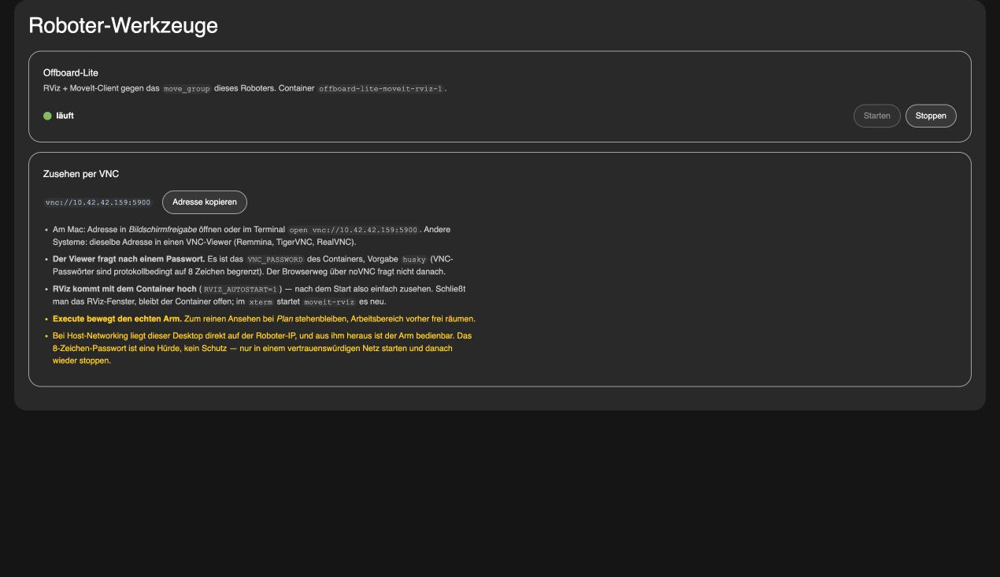
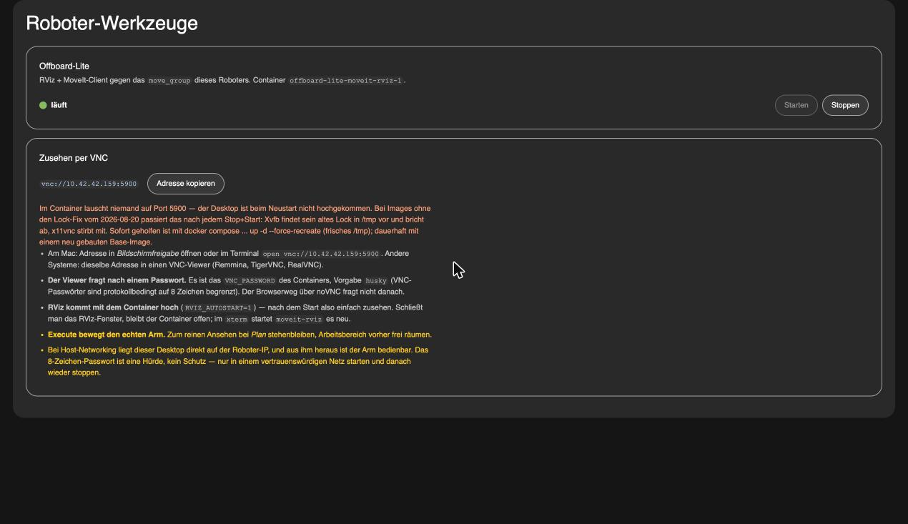

# cockpit-robot-tools

A Cockpit page for recurring manual tasks on the robot. Right now it holds
exactly one card: starting and stopping the **offboard-lite container**, with a
status dot and the address under which you can watch the container over VNC.

The name is deliberately kept open — further cards (other containers, other
tasks) get added here without the package having to be renamed.



*(Cockpit → "Roboter-Werkzeuge"; shown here in the workstation preview, see
[Development](#development).)*

## Features

- **One card for the offboard-lite container** — start, stop, status dot, and
  the VNC address to watch it.
- **The container is looked up, not guessed** — by compose service or image,
  so a different project directory does not break the page.
- **It says why port 5900 is closed from outside**, distinguishing a dead
  desktop from one that is merely unreachable.
- **No build step** — plain vanilla JS against `cockpit.js`.

## Tech Stack

Vanilla JS against `cockpit.js` (Cockpit ≥ 266), PatternFly 6 values as CSS
tokens; `node --test` for the state mapping. No node or npm on the robot.

## What the page does

**Status dot.** A `docker ps -a` every three seconds. In a background tab
nothing is polled — but the first query always runs, otherwise a page that was
never visible would sit on "checking…" forever.

The container is **looked up, not guessed**: compose forms the name as
`<project>-moveit-rviz-1`, and by default the project is named after the
directory — so a hard-wired name is a bet on where the files happen to live.
Detection goes by the compose service (`moveit-rviz`) or by the image
(`*offboard-lite*`); the large `husky-offboard` container is not swept up in
that. Which container is being operated is stated in the card, and if there
are several matches it names the others too.

| Dot | Meaning |
|---|---|
| green | `running` — the container is up |
| grey | `exited` / `created` / `paused` — **stopped, which is the normal case** |
| yellow, pulsing | start or stop under way, or `restarting` |
| grey, hollow | the container does not exist on this machine at all |
| red | Docker is not answering, no permissions, or container `dead` |

Stopped is deliberately **grey and not red**: otherwise the dot would glow
alarmingly most of the time although nothing is broken — and a real error
would drown in it.

**Start / stop.** `docker start` and `docker stop` on the container that was
found. The page creates **no** container and calls **no** `compose`; if it is
missing, it says so — without guessing a path it has not checked.
Whichever button makes no sense is greyed out (no `start` on a running
container, no `stop` on a stopped one).

**Why 5900 is closed from outside.** When the container runs, the page checks
`docker inspect` once and reports if the VNC port cannot listen externally at
all. Two causes produce the same picture — 6080 open, 5900 no answer — and
both arise when the container is **created**, so they survive every
`docker start`:

| Finding | What the page reports |
|---|---|
| `127.0.0.1:5900` does not answer inside the container | The desktop never came up — on images without the lock fix of 2026-08-20 after **every** stop+start |
| no `VNC_PASSWORD` in the environment | `x11vnc` runs with `-nopw` and then binds only to `127.0.0.1` |
| `NetworkMode` ≠ `host` | bridge network, `5900` sits only on the robot's loopback |

The first row is a measurement **from the inside** (`docker exec … bash -c
'exec 3<>/dev/tcp/127.0.0.1/5900'`) and separates a dead desktop from one that
is merely unreachable from outside — from outside the two look identical. A
single "dead" does not count: after `docker start` the container is
immediately `running` while Xvfb, fluxbox and x11vnc are still coming up, so
the finding has to occur three times in a row (about ten seconds).



As long as "no `VNC_PASSWORD`" holds, the page hides the note that the viewer
will ask for a password — two contradicting sentences side by side are worse
than one sentence fewer.

**VNC.** The address `vnc://<this-machine>:5900` as a link and to copy, plus
the hints you need there: how to open it on a Mac, that the viewer asks for
the container's `VNC_PASSWORD` (default `husky`, 8 characters by protocol
limit), that **RViz comes up with the container** (`RVIZ_AUTOSTART=1`) and can
be restarted in the `xterm` with `moveit-rviz` — and that *Execute* moves the
real arm.

The machine name comes from the address under which Cockpit was opened (via a
Cockpit jump host from `cockpit.transport.host`). If that says `localhost` or
`127.0.0.1` — Cockpit opened directly on the robot or through an SSH tunnel —
it would be the wrong machine as a VNC target; the fixed fallback `ROBOT_HOST`
in `index.js` then applies, currently `10.42.42.159`. A different network
(netbird) is entered there.

## Prerequisites on the robot

- **The container has to have been created once**, in the directory of the
  compose project:
  ```bash
  docker compose -f docker-compose.yml -f docker-compose.robot.yml up -d
  ```
  The `-f docker-compose.robot.yml` is part of it (host network), and
  `VNC_PASSWORD` has to be set — otherwise the page later starts a container no
  viewer can reach. What it is called does not matter, the page finds it. After
  that this page is enough for everything else.
- **Admin access in Cockpit.** The Docker calls run with
  `superuser: "require"`. Anyone who has not elevated to administrator in
  Cockpit sees a red dot with the error message.
- **Docker on the PATH.** On a200-0553 Docker is the *snap* Docker; the page
  therefore puts `/snap/bin` in front of the PATH before calling `docker`.

## Installation

No build. The package is plain vanilla JS against `cockpit.js` and is copied
exactly as it lies here — on the robot it needs neither node nor npm.

```bash
# from the workstation:
rsync -a robot/cockpit-robot-tools/ robot@10.42.42.159:~/cockpit-robot-tools/
ssh robot@10.42.42.159 'sudo ~/cockpit-robot-tools/install.sh'
```

The target is `/usr/local/share/cockpit/robot-tools` — the same level as the
[cockpit-ros2-diagnostics](../cockpit-ros2-diagnostics/README.md) fork; the two
packages do not interfere with each other. Afterwards reload
`http://<robot>:9090` in the browser; the menu entry is called
**Roboter-Werkzeuge**.

Removal: `sudo ~/cockpit-robot-tools/install.sh --uninstall`.

## Usage

Open Cockpit at `http://<robot>:9090`, elevate to administrator, and pick
**Roboter-Werkzeuge** from the menu. The card starts and stops the container
and shows the VNC address.

## Development

```bash
node --test test/*.test.mjs     # state mapping (status.js)
```

`status.js` is the only file with decision logic and therefore the only one
with tests: which color, which text, which button enabled. The rest of
`index.js` is DOM and `cockpit.spawn`.

The page can be viewed without a robot by putting a `cockpit.js` stub next to
it (see `test/preview/`) and serving the directory with any static server.

### The look

No PatternFly in the package, but PatternFly 6 values: `style.css` rebuilds the
root layout of
[cockpit-ros2-diagnostics](../cockpit-ros2-diagnostics/README.md) — light page
background, on it a tub with rounded corners and 1.5rem of spacing to the left,
right and bottom. Colors, spacings, radii and sizes sit as tokens in `:root`
and carry the PF name as a comment; anyone wanting to bring them up to date
measures them against the neighbouring package's built `dist/index.css`. Two
traps in doing so: in PF, spacings are **rem** and radii **absolute px** — and
a `1rem` used as a radius is a 12px corner in a browser with a 12px root, next
to the 16px corner beside it.

The dark theme comes from Cockpit, not from the operating system: `theme.js`
reads `shell:style` and sets `pf-v6-theme-dark` on the `<html>`, the same way
Cockpit's own `cockpit-dark-theme` does in the built packages. A plain
`@media (prefers-color-scheme: dark)` would be wrong as soon as shell and
system disagree.

## Security note

The VNC port now has a password (`VNC_PASSWORD`, default `husky`); VNC
passwords are limited to 8 characters by the protocol, which is a hurdle and
not protection. With `network_mode: host`, ports 5900/6080 sit directly on the
robot's IP, and from within the desktop the real arm can be operated through
MoveIt. This page makes starting it convenient — the trade-off stays the same
(R3 in [ROBOTER-TODO.md](../../ROBOTER-TODO.md)): only start it in a trusted
network, and stop it again afterwards.

## Running Tests

```bash
node --test test/*.test.mjs
```

## Related

- [husky-offboard-lite](../../deploy/husky-offboard-lite/README.md) — the container this page operates
- [cockpit-ros2-diagnostics](../cockpit-ros2-diagnostics/README.md) — the diagnostics plugin next to it

## Versioning

[Semantic Versioning](https://semver.org/) via `VERSION` and
[CHANGELOG.md](CHANGELOG.md).

## License

See the workspace root.
